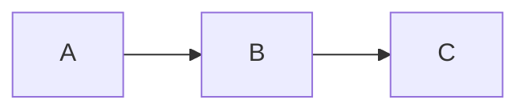

# DeFlow Labs — Documentation Site

Official documentation for the DeFlow settlement platform.

## Tech Stack

- **Framework:** Nuxt 4 (Vue 3)
- **Content:** Nuxt Content v3 (Markdown in Git)
- **UI:** Nuxt UI v4 (dark/light mode, search, navigation)
- **Editor:** Nuxt Studio (visual content editing)
- **Styling:** Tailwind CSS v4
- **Deployment:** Vercel (ISR, 1h cache)

## Getting Started

```bash
# Install dependencies
npm install

# Start dev server
npm run dev

# Build for production
npm run build
```

## Content Structure

Documentation is organized into 3 main sections accessible via header navigation:

```
content/
├── 0.index.md                              # Welcome page (hidden from sidebar)
├── 1.getting-started/                      # Section 1: Getting Started
│   ├── 1.what-is-deflow.md
│   ├── 2.creating-your-account.md
│   ├── 3.identity-verification.md
│   └── 4.platform-walkthrough.md
├── 2.user-guide/                           # Section 2: User Guide
│   ├── 1.trading/
│   │   ├── 1.otc-deal-lifecycle.md
│   │   ├── 2.creating-a-deal.md
│   │   ├── 3.escrow-and-funding.md
│   │   └── 4.settlement.md
│   ├── 2.rewards/
│   │   ├── 1.vip-tiers.md
│   │   ├── 2.referral-program.md
│   │   └── 3.ranks-system.md
│   ├── 3.security/
│   │   ├── 1.zero-pii-policy.md
│   │   └── 2.smart-contract-security.md
│   ├── 4.partners/
│   │   ├── 1.partner-program.md
│   │   └── 2.contact.md
│   └── 5.support/
│       ├── 1.faq.md
│       └── 2.glossary.md
└── 3.developer-docs/                      # Section 3: Developer Docs (Coming Soon)
    └── index.md
```

## MDC Components

Three custom MDC components are available for use in Markdown:

### Callout (renders as UAlert)

```md
::callout{type="tip"}
Your content here.
::
```

Types: `note`, `tip`, `warning`, `danger`

### Step Guide (numbered procedure)

```md
::step-guide
:::step{title="Step Title" n="1"}
Step content.
:::
::
```

### Mermaid Diagrams

````md

````

## Nuxt Studio

In development, a floating button appears to open the visual editor.
For production, configure the `studio` section in `nuxt.config.ts`
with your GitHub repository details.

## License

Proprietary © DeFlow Labs
