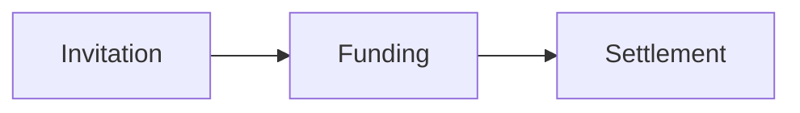

# DeFlow Documentation

Institutional product documentation for DeFlow, built with Nuxt 4, Nuxt Content 3, Nuxt UI 4, Tailwind CSS 4 and Mermaid. Release labels describe what is currently available without reducing the documentation to a temporary beta manual. This README is the single operating manual for setup, content governance, architecture, testing and Vercel deployment.

**Public URL:** [docs.deflowlabs.io](https://docs.deflowlabs.io)
**Runtime:** Node.js 24 LTS and npm 11+

## Ownership and release model

This repository owns public Markdown pages, navigation, search, page outlines, accessible content components, SEO, static generation and the checked-in public product-facts snapshot. It does not own canonical product claims or Sanity marketing content.

The public deployment is fully static and exposes no Nuxt Studio API. Optional visual authoring runs as a separate authenticated SSR project, writes to `content-editor`, and reaches `master` through a reviewed pull request.

```text
core/docs/PRODUCT_FACTS.yaml
             │ filtered, checked sync
             ▼
content/data/product-facts.yaml ──► fact-driven cards and tables

content/**/*.md ──► Nuxt Content ──► route renderer
                                         ├─ navigation, search and route-reactive ToC
                                         ├─ canonical, social and structured metadata
                                         └─ static Vercel output
```

## Repository layout

```text
docs/
├── app/
│   ├── components/content/   # Markdown UI and fact-driven components
│   ├── layouts/docs.vue      # Responsive navigation, search and current-page ToC
│   └── pages/                # Content route and index/error renderers
├── content/                  # Reviewed Markdown and generated public data
├── public/                   # Local fonts, robots and static assets
├── scripts/                  # Fact sync, content policy and static-output checks
├── tests/e2e/                # Playwright and axe accessibility coverage
├── content.config.ts         # Collection schemas and generated content types
├── nuxt.config.ts            # Static/public and optional authoring configuration
└── vercel.json               # Deployment commands, output and edge headers
```

The `core` and `docs` repositories must be siblings so fact synchronisation can read `../core/docs/PRODUCT_FACTS.yaml`.

## Local setup

```bash
node --version
npm --version
npm install
npm run facts:sync
npm run check
npm run dev
```

Open `http://localhost:3000`. Normal public-site development requires no secret. Stop the server with `Ctrl+C`.

| Command | Purpose |
|---|---|
| `npm run dev` | Start Nuxt development mode |
| `npm run facts:sync` | Regenerate the filtered public ledger snapshot |
| `npm run facts:check` | Reject snapshot drift |
| `npm run check:content` | Validate metadata, links, headings and prohibited claims |
| `npm run typecheck` | Run Nuxt/Vue type checking |
| `npm run check` | Run fact, content and type checks |
| `npm run generate` | Generate every route and verify static/SEO output |
| `npm run preview:static` | Serve `.output/public` on port 4173 |
| `npm run test:e2e` | Run responsive, keyboard and axe browser tests |

Generate before Playwright because `preview:static` serves existing output and does not rebuild it.

## Information architecture

The navigation follows reader intent:

1. **Getting Started** explains the DeFlow product model, product availability, access, identity, and wallet setup.
2. **User Guide** covers Trading, Syndicates, Rewards, Security, Partners and Help.
3. **Developer Guide — Coming soon** is a disabled, non-linking label. No Developer Guide route, content, search result or sitemap entry may exist until a supported public interface is approved.

The documentation is a durable product reference, not a temporary beta test manual. Release status belongs in availability labels, the Product Availability page, and environment-specific safety notes. Syndicates currently support FIFO allocation and per-approved-investor Sepolia escrows; pro-rata allocation, pooled escrow, and the on-chain controller remain planned. Never hide an implemented feature because its broader roadmap is incomplete, and never promote a roadmap increment as available.

Use numeric filename prefixes to control order; Nuxt Content removes them from routes:

```text
content/1.getting-started/1.what-is-deflow.md
→ /getting-started/what-is-deflow
```

Keep published URLs stable. Add a reviewed redirect before changing one.

## Page contract and editorial standard

Every public page requires:

```yaml
---
title: Page title
description: One clear 50–160 character search and social summary.
audience: [users, support]
availability: private-beta
lastVerified: 'YYYY-MM-DD'
sourceRefs: [PRODUCT_FACTS.yaml, relevant-runtime-file.ts]
robots: index,follow
---
```

Allowed audiences are `users`, `partners`, `support` and `risk-reviewers`. Availability is `private-beta`, `limited-beta`, `planned` or `internal`.

Write in plain British English. Begin body sections at H2 because the renderer supplies H1. Define specialised terms, keep procedures action-led, identify prerequisites and safe failure paths, and state testnet/audit/legal limits beside affected claims. Update `lastVerified` only after checking all named evidence. The right-hand ToC comes from the current route; never cache or hard-code it.

## Product-fact governance

Never edit `content/data/product-facts.yaml` directly. The sync deliberately excludes internal GitHub roadmap and delivery-history records.

1. Verify runtime constants, deployment manifests, current records or signed evidence.
2. Edit `../core/docs/PRODUCT_FACTS.yaml` and its matching `factRecords` owner, date, revision and sources.
3. In `/core`, run `pnpm product:sync`.
4. In `/docs`, run `npm run facts:sync && npm run check`.
5. Review rendered availability, fees, VIP, network and assurance components.

Runtime/deployment evidence determines availability. GitHub issues determine delivery tracking. A closed issue does not automatically approve a public claim. CI checks out the `stage` revision of `deflowlabs/core` beside this repository through the organisation's short-lived GitHub App token and records the exact source SHA in the run summary.

## Content components

| Component | Use |
|---|---|
| `::product-availability` | Complete fact-driven capability boundary |
| `::feature-grid` | Visual section or journey index |
| `::fee-schedule` | Commercial fee tiers from structured facts |
| `::vip-ranks` | VIP thresholds and discounts from structured facts |
| `::callout{type}` | Material note, tip, warning or danger |
| `::step-guide` / `:::step` | Ordered procedure |
| Mermaid fence | Accessible process or relationship visual |

```md
::step-guide
:::step{title="Connect the approved wallet"}
Follow the wallet prompt and confirm the displayed network.
:::
::
```

Label every Mermaid diagram and explain its essential meaning in prose:

````md

````

`MermaidDiagram.vue` uses strict security, light/dark themes, named keyboard controls, reduced motion and a focus-managed fullscreen dialog. Raw diagram source is not public.

## Accessibility and SEO

The target is WCAG 2.2 AA. Preserve landmarks, skip link, visible focus, semantic tables, accessible overflow, named controls, keyboard search, Escape handling and focus return.

Every indexable route needs a unique title/description, canonical, robots policy, Open Graph/Twitter metadata, JSON-LD, breadcrumbs and sitemap entry. `scripts/verify-static.mjs` validates generated HTML. Error and retired Developer Guide routes are 404/noindex. Fonts are bundled locally using the approved Geist/Geist Mono brand stack.

## Environment variables

### Public Docs Vercel project

Set in Development, Preview and Production:

| Variable | Value | Secret |
|---|---|---|
| `NUXT_STUDIO_ENABLED` | `false` | No |

Do not add GitHub OAuth credentials to the public project.

### Optional separate Nuxt Studio authoring project

This is not the Sanity Studio in `/studio`.

| Variable | Purpose | Secret |
|---|---|---|
| `NUXT_STUDIO_ENABLED=true` | Enables authoring runtime | No |
| `NUXT_STUDIO_BRANCH=content-editor` | Review branch | No |
| `STUDIO_GITHUB_CLIENT_ID` | GitHub OAuth client ID | No |
| `STUDIO_GITHUB_CLIENT_SECRET` | GitHub OAuth secret | Yes |

Use callback `https://<authoring-host>/__nuxt_studio/auth/github`. Protect `content-editor` and require a pull request into `master`.

## GitHub Actions

`.github/workflows/quality.yml` runs on every pull request and push to `master` with Node 24. Its stable required check is `Docs / Required`. It checks out and records the canonical `core` revision, validates facts/content/types, generates and inspects every static route, runs responsive Playwright and axe coverage, audits production dependencies, runs actionlint/zizmor/Semgrep/Trivy, and retains browser, SBOM and security evidence.

The `docs-playwright-*` artifact contains a navigable `playwright-report/index.html` plus retry evidence for 30 days; the security artifact and CycloneDX SBOM are retained for 90 days.

| GitHub setting | Purpose |
|---|---|
| Variable `DEFLOW_CI_APP_CLIENT_ID` | Organisation GitHub App client ID |
| Secret `DEFLOW_CI_APP_PRIVATE_KEY` | GitHub App private key; short-lived tokens are minted per run |
| Team `@deflowlabs/engineering` | Code owner configured by `.github/CODEOWNERS` |

Grant the App read-only Contents access to `deflowlabs/core`; do not use a personal access token. Protect `master`, require code-owner review, conversation resolution and `Docs / Required`, and prevent force pushes. Repository workflow permissions can remain read-only, and **Allow GitHub Actions to create and approve pull requests** should be disabled because no Docs workflow creates a pull request. Dependabot surfaces all update levels for review, including majors; no major is silently hidden.

The v3 token action prefers the App client ID and temporarily falls back to the legacy App ID so the migration does not interrupt CI. Add `DEFLOW_CI_APP_CLIENT_ID`, confirm a successful default-branch run uses the client-ID step, then remove `DEFLOW_CI_APP_ID`; the fallback and its deprecation warning can be removed in the same reviewed cleanup. Dependabot checks run on Mondays at 06:00 Europe/Lisbon. npm uses 3-, 7- and 30-day patch/minor/major cooldowns, while Actions use GitHub's supported seven-day default cooldown; security updates are not delayed. After `Documentation Quality` succeeds, `dependabot-queue.yml` enables native squash auto-merge, but one maintainer approval and all protected-branch requirements remain mandatory.

## Vercel deployment

`vercel.json` is authoritative.

| Setting | Value |
|---|---|
| Root Directory | `docs` in a parent repository; blank when standalone |
| Framework Preset | Nuxt.js / automatic |
| Node.js | 24.x |
| Install | `npm ci` |
| Build | `npm run generate` |
| Output | `.output/public` |
| Production Branch | `master` |
| Domain | `docs.deflowlabs.io` |

Do not replace `generate` with `build`; generation also verifies routes and SEO. Keep the facts snapshot checked in so Vercel needs no private-core access during build.

Before promotion:

```bash
npm ci
npm run facts:check
npm run check
npm run generate
npm run test:e2e
npm audit --omit=dev
```

Confirm `robots.txt` and `sitemap.xml` return 200, `/developer-guide/coming-soon` returns a noindex 404, `/_studio` is unavailable, edge security headers are present, and search/ToC work after client navigation. Roll back through Vercel history if unhealthy; fix source rather than generated output.

## Troubleshooting

- **Page or ToC is stale:** stop old servers, regenerate, restart `preview:static`, and hard-refresh. Test client-side navigation.
- **Facts are stale:** update core and run `facts:sync`; never patch the snapshot.
- **Page is missing:** check its collection, prefix and frontmatter, then run `npm run check`.
- **Broken static link:** use an absolute public path and create the target before linking it.
- **Authoring fails remotely:** verify SSR, exact OAuth callback, server-side secrets and that public Studio remains disabled.

## Maintenance rules

- Add a ledger capability before changing public availability.
- Add a section overview when a category grows beyond three procedures.
- Split pages by user goal, not arbitrary length.
- Use UI elements only when they improve comprehension.
- Update the glossary for new terms and FAQ for repeated questions.
- Document exported functions, non-obvious state and security boundaries close to code; avoid comments that restate syntax.
- Run the static/browser suite after changes to navigation, components, metadata or layouts.

Proprietary © DeFlow Labs
