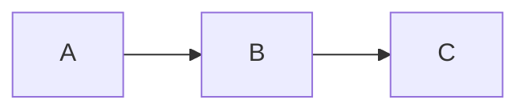

# DeFlow Labs — Documentation Site

Official documentation for the DeFlow settlement platform.

## Tech Stack

- **Framework:** Nuxt 4 (Vue 3)
- **Content:** Nuxt Content v3 (Markdown in Git)
- **UI:** Nuxt UI v4 (dark/light mode, search, navigation)
- **Editor:** Nuxt Studio (visual content editing)
- **Styling:** Tailwind CSS v4
- **Deployment:** Vercel (ISR, 1h cache)

## Getting Started

```bash
# Install dependencies
npm install

# Start dev server
npm run dev

# Build for production
npm run build
```

## Content Structure

All documentation content is stored as Markdown files in the `content/` directory:

```
content/
├── index.md                     # Home page
├── 1.getting-started/           # Account setup, verification, walkthrough
├── 2.trading/                   # Deal lifecycle, escrow, settlement
├── 3.rewards/                   # VIP tiers, referrals, ranks
├── 4.security/                  # Zero-PII, smart contract security
├── 5.partners/                  # Partner program, contact
└── 6.support/                   # FAQ, glossary
```

## MDC Components

Three custom MDC components are available for use in Markdown:

### Callout (renders as UAlert)

```md
::callout{type="tip"}
Your content here.
::
```

Types: `note`, `tip`, `warning`, `danger`

### Step Guide (numbered procedure)

```md
::step-guide
:::step{title="Step Title" n="1"}
Step content.
:::
:::step{title="Next Step" n="2"}
More content.
:::
::
```

### Mermaid Diagrams

Use fenced code blocks with `mermaid` language:

````md

````

## Nuxt Studio

In development, a floating button appears to open the visual editor.
For production, configure the `studio` section in `nuxt.config.ts`
with your GitHub repository details.

## License

Proprietary © DeFlow Labs
