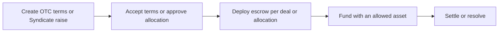

DeFlow provides infrastructure for coordinating and settling digital-asset transactions. It gives participants a shared workflow for agreeing terms, satisfying readiness controls, deploying deal-specific escrow, funding, settlement, refunds, and disputes.

## Product capabilities

DeFlow's product model brings together:

- **OTC settlement:** bilateral deal creation, invitation, acceptance, escrow funding, settlement, refund, and dispute handling.
- **Syndicates:** issuer-led raises with investor allocation requests, approval, per-investor escrow, and coordinated closing.
- **Desks and partners:** organisational access, attribution, fee schedules, commissions, and partner operations.
- **Rewards:** VIP progression, fee discounts, referral economics, and controlled reward claims.
- **Security and evidence:** readiness policies, immutable deal parameters, indexed contract events, and documented governance powers.

## How a transaction moves through DeFlow

1. A verified participant creates OTC terms or a Syndicate raise.
2. Counterparties review the terms; Syndicate investors request allocations for issuer approval.
3. DeFlow deploys a complete, immutable Escrow contract at a deterministic CREATE2 address for an OTC deal or approved Syndicate allocation.
4. Participants fund the escrow with an asset allowed for that deployment.
5. Settlement, refunds, or dispute handling follow the contract's rules and documented governance controls.

## Operating principles

- Off-chain application state does not replace on-chain evidence for contract actions.
- Every participant should verify the network, asset, escrow address, roles, amounts, fees, and deadlines before signing.
- Deal-specific Escrow instances are non-upgradeable; governance powers and the upgradeable FeeRouter are documented explicitly.
- Availability, audit, and legal status are stated separately from the intended product design.

::callout{type="note"}
The current release runs on Ethereum Sepolia with TestUSDC and is not a production or mainnet settlement service. See [Product availability](/getting-started/product-availability) for the current environment and [Smart-contract security](/user-guide/security/smart-contract-security) for governance powers.
::

## Who the documentation is for

These guides serve participants, counterparties, issuers, partners, support teams, risk reviewers, and decision-makers. They explain the product in plain language while preserving the implementation and assurance details required for professional review.
