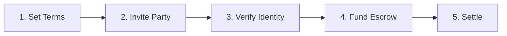

DeFlow is an institutional-grade settlement layer and asset management platform for digital asset dealflows. It enables bilateral trades, multi-investor syndicate raises, and additional dealflow types with atomic on-chain execution and full regulatory compliance.

Think of DeFlow as the infrastructure that makes high-value digital transactions safe, transparent, and compliant. We do not replace brokers or trading desks — we give them a settlement layer they can trust.

## How a Deal Works

Every deal on DeFlow follows five simple steps:

1. **Set the terms** — The deal creator defines the asset pair, amount, price, and settlement window
2. **Invite the counterparty** — Share a deal link with the other party
3. **Verify identity** — Both participants must pass identity and compliance checks
4. **Fund the escrow** — Both sides deposit their assets into a smart escrow contract on the blockchain
5. **Settle** — The escrow releases both sides' assets in a single, irreversible transaction

Funds never touch DeFlow. The smart escrow only releases when both parties fulfil their obligations.

## The Problem

Settling high-value digital asset transactions today is a fragmented, trust-dependent process. Whether it is a bilateral trade, a syndicate raise, or a tokenised asset transfer, counterparties rely on manual wire transfers, spreadsheet tracking, and informal agreements. There is no standard infrastructure to enforce settlement terms, verify identities, or resolve disputes.

| Challenge | How DeFlow Solves It |
|:----------|:---------------------|
| Deals rely on counterparty trust | Smart escrow contracts enforce all-or-nothing settlement |
| Manual settlement via wire transfers | Atomic on-chain settlement in a single transaction |
| Identity verification is fragmented | Built-in compliance layer with status-based access control |
| No standard dispute resolution | Configurable dispute windows with governance fallbacks |
| Opaque fee structures | Transparent, tiered, on-chain fee routing |
| No post-settlement visibility | Portfolio tracking, reporting, and audit trail from settlement data |

## Dealflow Types

DeFlow is asset-agnostic and dealflow-agnostic. The same smart escrow infrastructure settles different types of deals:

| Type | Description | Status |
|:-----|:------------|:------:|
| **OTC Trades** | Bilateral large-value trades between verified counterparties | Live |
| **Syndicate Raises** | Multi-investor capital formation with allocation management and batch settlement | Live |
| **RWA Tokenization** | Settlement for real-world-asset-to-token conversions | Roadmap |
| **PE Secondaries** | Private equity position transfers with compliance enforcement | Roadmap |
| **Structured Products** | Complex multi-party dealflows with custom terms | Roadmap |

## Core Principles

### Non-Custodial

DeFlow never holds user funds. Every deal settles through a dedicated smart escrow contract deployed on the blockchain. Funds are locked in the contract until both parties fulfil their obligations. The platform cannot access, redirect, or seize escrowed assets.

### Atomic Settlement

Settlement is atomic: both sides of a deal are executed in a single, irreversible transaction. Either both parties receive their assets, or neither does. This eliminates counterparty risk entirely.

### Zero-PII Compliance

DeFlow operates under a strict Zero Personally Identifiable Information policy. No names, email addresses, or personal data are stored in the platform database. Identity verification retains only status flags (verified, pending, blocked). Read more in the [Zero-PII Policy](/user-guide/security/zero-pii-policy).

### Transparent Fees

All platform fees are routed on-chain through a transparent fee schedule. Rates are determined by deal size, user tier, and partner rebates. Every fee is visible before a deal is confirmed. There are no hidden costs.

## What DeFlow IS and IS NOT

| DeFlow IS | DeFlow is NOT |
|:----------|:--------------|
| A settlement layer | Not an exchange |
| A compliance engine | Not a custodian |
| Escrow automation | Not a broker |
| Post-trade infrastructure | Not a wallet |

DeFlow is infrastructure — like a payment rail for digital assets. We process the settlement; we do not take the other side of any trade.

## Who Uses DeFlow

### Financial Institutions

Banks, family offices, and hedge funds use DeFlow through white-label desks to settle trades with built-in compliance and post-settlement portfolio tracking.

### Digital Asset and RWA Sector

Mining firms, RWA platforms, and protocol treasuries use DeFlow for compliant settlement with privacy-preserving identity verification and automatic position tracking.

### Private Markets

VCs, corporate treasuries, and syndicate managers use DeFlow to run multi-investor raises with per-investor allocation tracking and batch settlement.

## Post-Settlement: Asset Management

Every settled deal automatically populates the participant's portfolio with full provenance — compliance-verified, on-chain-anchored, and audit-ready. This means:

- **Portfolio visibility** — Track all settled positions with cost basis, counterparty data, and compliance status
- **Reporting** — Generate settlement certificates, period reports, and tax-lot exports
- **Risk analytics** — Monitor exposure, concentration limits, and liquidity status across wallets

Free portfolio visibility is included for all users. Premium reporting and risk analytics are available for institutional desks.

## Next Steps

Ready to get started? Continue to [Creating Your Account](/getting-started/creating-your-account) to set up your profile and connect your wallet.
