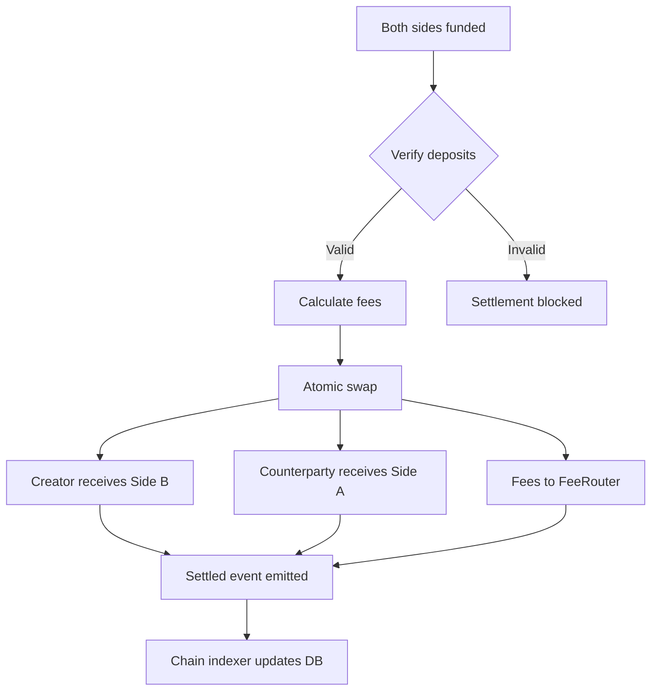

# Settlement

Settlement is the final stage of the deal lifecycle. When both parties have fully funded the escrow, the smart contract executes an atomic swap, delivering assets to both sides in a single, irreversible transaction.

## Atomic Delivery-versus-Payment

DeFlow implements Delivery-versus-Payment (DvP) at the smart contract level. This means:

- Both sides of the trade execute in a single atomic transaction
- Either both parties receive their assets, or neither does
- There is no window during which one party has received assets while the other has not
- Settlement cannot be partially completed

This eliminates counterparty risk entirely. There is no possibility of one party defaulting after receiving the other party's assets.

## Settlement Process

When the final funding transaction confirms on-chain, the following sequence executes within a single transaction:

::step-guide

:::step{title="Funding Verification" n="1"}
The escrow contract verifies that both sides have deposited the exact amounts specified in the deal terms. If either side is incomplete, the settlement does not proceed.
:::

:::step{title="Fee Calculation" n="2"}
The FeeRouter contract calculates the applicable fees:
- Base platform fee (typically 0.50% of notional value)
- VIP tier discount, if applicable
- Referral credit redemption, if applicable
- Partner rebate, if applicable

The net fee is deducted from the settlement amounts.
:::

:::step{title="Asset Transfer" n="3"}
The escrow contract transfers:
- The creator's deposited assets to the counterparty
- The counterparty's deposited assets to the creator
- The calculated fees to the platform treasury via the FeeRouter

All three transfers occur atomically within the same transaction.
:::

:::step{title="Event Emission" n="4"}
The escrow contract emits a **Settled** event containing the deal identifier, final amounts, fee breakdown, and block timestamp. This event serves as the permanent, immutable record of the settlement.
:::

:::step{title="Platform Indexing" n="5"}
The platform's chain indexer service detects the Settled event and updates the deal status in the database. Both parties see the deal marked as **Settled** on their dashboard, with a link to the on-chain transaction.
:::

::

## Finality

Settlement on DeFlow is final. Once the on-chain transaction is confirmed with sufficient block confirmations (6 blocks on Ethereum mainnet, 1 block on test networks), the deal is considered permanently settled. The transaction cannot be reversed, modified, or disputed after confirmation.

::callout{type="warning"}
Review all deal terms carefully before funding. Once both sides are funded, settlement executes automatically and cannot be undone.
::

## Post-Settlement

After settlement, the following records are available:

| Record | Where to find it |
|--------|-----------------|
| **Deal summary** | Deal detail page on the platform |
| **On-chain transaction** | Block explorer link provided on the deal page |
| **Fee breakdown** | Deal detail page, including base fee, discounts, and net amount |
| **Event history** | Complete timeline of all deal events (created, accepted, deployed, funded, settled) |

### Impact on Your Account

Settlement updates several aspects of your account:

- **Lifetime volume** increases by the deal's notional value
- **Deal count** increments by one
- **VIP tier** may advance if the new volume crosses a milestone threshold
- **Referral earnings** are credited to your referrer (if applicable)
- **Fee credits** are deducted if they were applied to this deal

## Settlement Timing

| Scenario | Expected Duration |
|----------|------------------|
| Both parties fund within minutes | Settlement executes within the same block or next block |
| Funding spread over hours or days | Settlement executes immediately when the second party funds |
| Expiry window elapses before both fund | Deal is cancelled; deposits are refunded automatically |

There is no manual "settle" action required. Settlement is triggered automatically by the second funding transaction.

## Verification

Both parties can independently verify the settlement by:

1. Checking the deal status on the platform dashboard
2. Inspecting the escrow contract on a block explorer using the contract address displayed on the deal page
3. Verifying the **Settled** event in the transaction logs
4. Confirming that their wallet balance reflects the received assets

## Next Steps

To learn about the incentive structure that rewards trading activity, see [VIP Tiers](/rewards/vip-tiers) and the [Referral Program](/rewards/referral-program).
