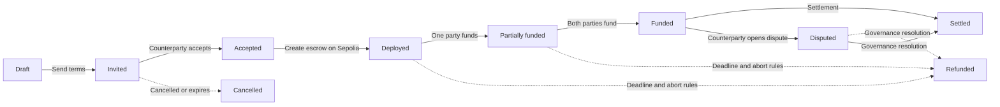

Every DeFlow OTC deal follows an explicit lifecycle. A status change in the interface does not replace the corresponding on-chain confirmation when a contract action is involved.

## Before deployment

Draft and invitation changes are off-chain. Both parties should independently review the asset address, amount, roles, fee allocation, deadlines, and counterparty before acceptance.

## After deployment

EscrowFactory deploys a complete Escrow instance using CREATE2. The deal's instance is not upgradeable, but it includes the governance methods documented in [Smart-contract security](/user-guide/security/smart-contract-security).

## Terminal outcomes

- **Settled:** the contract completed its payout path.
- **Refunded:** deposits were returned or split through an allowed refund or dispute path.
- **Cancelled:** no on-chain settlement was completed.

Always retain the deal ID, escrow address, and transaction hash when asking for support.
