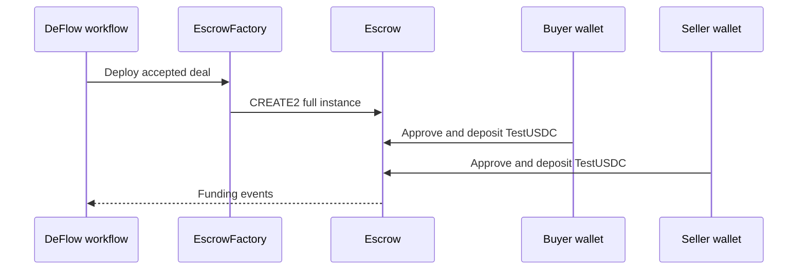

After both parties accept the terms, the deployment service can create a dedicated Escrow contract. The current release deploys to Ethereum Sepolia.

## Contract creation

EscrowFactory uses the deal ID and chain ID to derive a CREATE2 salt, then deploys a complete Escrow instance rather than a minimal proxy clone. The deployed Escrow's deal parameters are immutable.

## Verify before funding

Compare the network, deal ID, escrow address, TestUSDC address, amount, parties, deadline, dispute window, and fee split with the accepted terms. Stop if the wallet requests another network or token.

## Fund the escrow

Each party approves and deposits the amount shown for its side. Token approval and deposit may be separate transactions. Wait for the interface to recognise the required Sepolia confirmations before continuing.

## Refund and intervention paths

Unfunded or partially funded escrows can be aborted after the deadline by a counterparty or governance. Funded disputes can be resolved by governance, and the contract includes refund, settlement, and emergency rerouting methods. These powers are described on [Smart-contract security](/user-guide/security/smart-contract-security).
