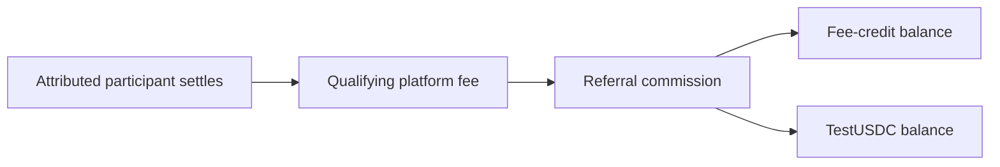

An eligible participant can share a referral code. When an attributed participant settles a qualifying deal, the system calculates a referral reward from the platform fee.

## Current mechanics

- Standard ranks use a 5% referral commission; ranks 12–19 use 10%.
- The reward splits between fee credits and a TestUSDC balance according to the referrer's rank.
- Fee credits can reduce eligible future fees within configured limits.
- Withdrawal eligibility includes a minimum balance, cooldown, monthly cap, and anti-self-referral rules.

## Referral lifecycle

1. Copy your code from the rewards area.
2. Share it through a trusted channel without promising financial returns.
3. Ask the new participant to enter it during the supported attribution step.
4. After a qualifying settlement, compare the recorded commission and split with your current VIP rank.

::callout{type="warning"}
The current release's cash-labelled balance and withdrawals use TestUSDC. TestUSDC has no monetary value and is not a payable cash entitlement.
::
