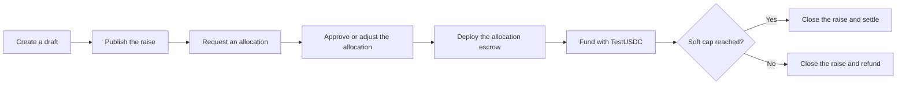

DeFlow Syndicates let an issuer coordinate a multi-investor raise through structured terms, allocation requests, issuer approvals, per-investor escrow, funding, and closing. The capability is available in private beta; full environment integration validation remains pending.

::callout{type="warning"}
The current release uses only Sepolia ETH and TestUSDC. Publication, approval, funding progress, VIP volume, or settlement in this environment is not an investment offer, production transaction, or statement of monetary value.
::

## Current model

- The issuer defines a soft cap, hard cap, minimum ticket, funding deadline and access mode.
- Investors request allocations.
- An issuer or authorised desk role approves or adjusts requests up to the hard cap.
- Each approved allocation receives its own complete Escrow contract on Sepolia.
- The current implementation applies FIFO allocation, not pro-rata allocation.
- Syndicate state is coordinated by the application backend and recorded in the event index.

This design is sometimes called **sharded escrow** because each investor has a separate escrow. It is not the planned single pooled contract.

## Lifecycle

## Roles

| Role | Responsibility |
|---|---|
| Issuer | Creates terms, publishes the raise, reviews allocations and closes the raise. |
| Investor | Opens the shared link, passes readiness checks, requests an allocation and funds an approved allocation. |
| Desk owner or administrator | May help manage the raise and allocations according to desk permissions. |
| DeFlow support | Helps resolve readiness, allocation, escrow, funding, and settlement issues. |

## Statuses

| Status | Meaning |
|---|---|
| Draft | Terms can still be updated. |
| Published | The shared raise can accept allocation requests. |
| Funding | At least one allocation has entered funding. |
| Closed | The raise met its soft cap and settlement processing was initiated. |
| Refunded | The soft cap was not met and refund handling was initiated. |

## Not included

- Pro-rata oversubscription.
- A single pooled escrow contract.
- `SyndicateController.sol` or on-chain Syndicate lifecycle events.
- Distribution and vesting schedules.
- Mainnet assets or production settlement.

Continue with [Creating and publishing a Syndicate](/user-guide/syndicates/creating-and-publishing) or [Joining and funding](/user-guide/syndicates/joining-and-funding).
