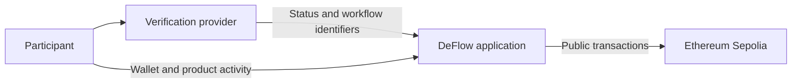

DeFlow is designed to minimise the personal information stored in its application database. This is an architectural objective, not a certification that the platform stores no personal data under every legal definition.

## Current boundary

- Identity documents and verification inputs are processed by the identity provider.
- DeFlow stores provider identifiers, verification status, timestamps, policy results, wallet addresses, usernames, and application activity needed to operate the service.
- Email identifiers are normalised and HMAC-SHA256 hashed before application storage.
- Blockchain addresses and transaction activity are public on Ethereum Sepolia.

## Protect your privacy

- Do not put a legal name, email address, or confidential organisation detail in a public username or deal note.
- Do not send identity documents to support.
- Remember that wallet addresses and contract events are visible publicly.
- Use the legal and privacy contacts on the DeFlow website for data-rights requests.

The formal privacy, GDPR, eIDAS, and retention positions remain subject to qualified legal review.
