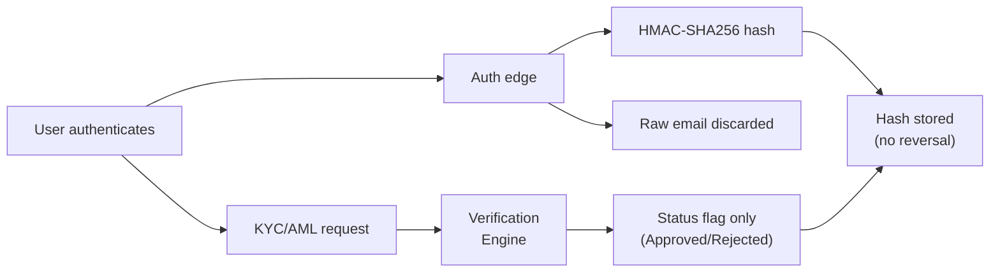

DeFlow operates under a strict **Zero Personally Identifiable Information** policy. No names, email addresses, phone numbers, physical addresses, or other personal data are stored in the platform database. This approach is foundational to the platform's architecture, not an afterthought.

## What Zero-PII Means

In a conventional platform, user registration collects and stores personal information such as names, email addresses, and identity documents. DeFlow takes a fundamentally different approach:

| Conventional Platform | DeFlow |
|----------------------|--------|
| Stores email addresses in plaintext | Hashes email addresses using HMAC-SHA256; the original is discarded immediately |
| Stores names and personal details | Stores only a user-chosen username |
| Retains identity documents | Identity verification is performed by a certified third party; DeFlow receives only status flags |
| Logs user IP addresses and sessions | Sensitive data is redacted from all logs and error reports |

## How It Works

### Email Handling

When a user authenticates, their email address is processed as follows:

1. The email is received at the authentication boundary
2. It is immediately hashed using **HMAC-SHA256** with a dedicated cryptographic salt
3. Only the hash is stored in the database for deduplication purposes
4. The original email is discarded and never persisted

This means that even with full database access, it is computationally infeasible to reverse the hash and recover the original email address.

### Identity Verification

DeFlow's identity verification engine handles all KYC and AML checks through a certified, independent process. The verification flow is designed so that DeFlow never handles personal documents:

1. The user is redirected to a secure verification portal
2. The verification engine conducts the identity check using the user's government-issued ID and biometric data
3. Only a **status flag** is returned to DeFlow (Approved, Pending, Blocked, or Rejected)
4. No personal data, document images, or biometric information is transmitted to DeFlow

| Data | Stored by DeFlow | Stored by Verification Provider |
|------|:----------------:|:-------------------------------:|
| Government ID images | No | Yes (per their retention policy) |
| Biometric data | No | Yes (per their retention policy) |
| Full name | No | Yes |
| Date of birth | No | Yes |
| Verification status | Yes | Yes |
| KYC tier level | Yes | Yes |
| AML screening result | Yes (Pass/Fail only) | Yes |

### Wallet Screening

Wallet addresses are screened against international sanctions databases (OFAC, EU, UN, OFSI, and others) through DeFlow's wallet screening engine. The screening returns a pass or fail result. Wallet addresses themselves are not considered PII, as they are public blockchain data.

### Error Reporting and Observability

DeFlow's error monitoring system processes all error reports through a custom filter that strips:

- Email addresses
- JWT tokens
- Private keys
- IP addresses
- Usernames (where not essential for debugging)

This ensures that even in error scenarios, personal data does not appear in monitoring systems.

## What DeFlow Stores

The following is a complete list of user-related data stored in the platform database:

| Field | Purpose |
|-------|---------|
| User ID (UUIDv7) | Internal identifier |
| Username | Display name chosen by the user |
| Wallet address | Public blockchain address (not PII) |
| Email hash (HMAC-SHA256) | Deduplication only; original is not recoverable |
| Verification status | KYC approval state |
| KYC tier | Verification level |
| AML result | Screening pass or fail |
| AML timestamp | When the last screening occurred (for 24-hour freshness) |
| VIP tier and volume | Trading statistics |
| Referral code | Unique referral identifier |
| Referral balances | Fee credits and cash balance |

## What DeFlow Does Not Store

- Real names
- Email addresses (only irreversible hashes)
- Phone numbers
- Physical addresses
- Dates of birth
- Identity document images
- Biometric data
- IP addresses (in application database)

## Compliance Alignment

The Zero-PII architecture aligns with major data protection frameworks:

| Framework | Alignment |
|-----------|-----------|
| **GDPR** (EU) | Minimises personal data collection; supports the data minimisation principle |
| **eIDAS 2.0** (EU) | Compatible with selective disclosure model of European Digital Identity Wallets |
| **CCPA** (California) | Reduces scope of consumer data subject to access and deletion requests |

::callout{type="note"}
Because DeFlow does not store recoverable personal data, many data subject access requests (DSARs) are satisfied by default. There is no personal data to export or delete.
::

## Next Steps

To understand how the smart contracts that handle your funds are designed and secured, see [Smart Contract Security](/user-guide/security/smart-contract-security).
