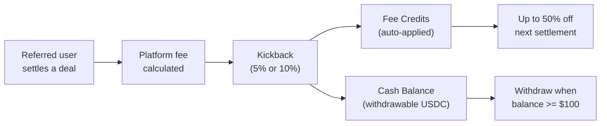

# Referral Program

The DeFlow Referral Program rewards users for introducing new traders to the platform. Every time a referred user settles a deal, the referrer earns a kickback, which is a percentage of the platform fee split into two reward buckets.

## How It Works

::step-guide

:::step{title="Get Your Referral Code" n="1"}
Every DeFlow user receives a unique referral code (format: `NX` followed by 8 characters, for example `NX8K2M4P`). Find your code on the **Referrals** page, where a **Copy Link** button generates a shareable URL.
:::

:::step{title="Share with Others" n="2"}
Send your referral link to anyone you would like to invite to the platform. When they create an account using your link, they are permanently linked to you as their referrer. Attribution is permanent and cannot be changed.
:::

:::step{title="Earn on Every Deal" n="3"}
Every time your referred user settles a deal, you earn a kickback. The kickback is a percentage of the platform fee charged on that deal:

| Referral Tier | Commission Rate | How to Unlock |
|---------------|:--------------:|---------------|
| Standard | 5% of platform fee | Default for all users |
| Master Rev-Share | 10% of platform fee | Reach Platinum III (Rank 12) |
:::

:::step{title="Collect Your Rewards" n="4"}
Your earnings are automatically split into two reward buckets (explained below). Fee credits are applied automatically, and cash rewards can be withdrawn when your balance meets the minimum threshold.
:::

::

## The Dual-Bucket Model

Referral earnings are split into two distinct buckets:

| Bucket | What It Is | How to Use It | Expiry |
|--------|-----------|---------------|--------|
| **Fee Credits** | Discount balance applied to your own deal fees | Automatically applied as up to 50% off your next settlement fee | 12 months from the date the referral link was established |
| **Cash Balance** | Withdrawable USDC reward | Request withdrawal when balance reaches $100 | No expiry |

### Split Ratios by VIP Tier

The proportion of each kickback allocated to credits versus cash depends on your current VIP tier:

| VIP Tier | Credit Portion | Cash Portion | Monthly Earning Cap |
|----------|:-------------:|:------------:|:-------------------:|
| Bronze (Ranks 1 to 3) | 80% | 20% | $1,000 |
| Silver (Ranks 4 to 6) | 70% | 30% | $5,000 |
| Gold (Ranks 7 to 9) | 60% | 40% | $25,000 |
| Platinum (Ranks 10 to 12) | 50% | 50% | $100,000 |
| Diamond (Ranks 13 to 15) | 40% | 60% | $500,000 |
| Obsidian (Ranks 16 to 18) | 40% | 60% | $500,000 |
| Sovereign (Rank 19) | 40% | 60% | $500,000 |

Lower tiers receive a higher proportion of credits to encourage continued platform usage. Higher tiers receive more cash, recognising the commitment demonstrated through trading volume.

## Earning Example

Consider a Bronze I user who has referred five traders:

1. The referred traders collectively settle $100,000 in deals
2. The platform fee on those deals totals $500 (at the 0.50% base rate)
3. The referrer's kickback is 5% of $500 = **$25**
4. At Bronze tier (80/20 split), the referrer receives:
   - **$20** in fee credits (applied automatically on the next deal)
   - **$5** in cash balance (accumulates toward the $100 withdrawal minimum)

## Using Fee Credits

Fee credits are applied automatically when you settle a deal:

1. The platform calculates your settlement fee
2. If your credit balance is greater than zero, credits are applied as a discount of up to **50%** of the fee
3. Credits are consumed on a first-earned, first-redeemed basis
4. The redeemed amount is deducted from your credit balance and recorded in your earnings ledger

::callout{type="note"}
Credits expire 12 months after the referral link was established. Monitor your credit balance on the Referrals page to use them before expiry.
::

## Withdrawing Cash

To withdraw your cash balance as USDC:

| Requirement | Detail |
|-------------|--------|
| **Minimum balance** | $100 USD equivalent |
| **Cooldown** | 30 days between withdrawals |
| **Settlement method** | USDC deposited to your connected wallet via the on-chain ReferralVault contract |
| **Processing** | Request submitted on the Referrals page; settlement executes on-chain |

Navigate to **Referrals > Request Withdrawal** to initiate the process.

## Anti-Abuse Protections

The referral system includes safeguards against manipulation:

- **Self-referral prevention**: You cannot earn referral rewards on your own deals
- **Monthly earning caps**: Referral earnings are capped per calendar month based on your VIP tier
- **Wash trading detection**: Deals where the creator and counterparty are the same user do not generate referral earnings

## Shadow Identity

If you share your referral link with someone who has not yet created a DeFlow account, the attribution is preserved. When that person eventually creates an account and verifies their identity, the referral link is activated retroactively. This ensures you receive credit for introductions regardless of when the referred user completes registration.

## Next Steps

For a complete table of every rank, its volume threshold, and the referral parameters at each level, see the [Ranks System](/rewards/ranks-system).
