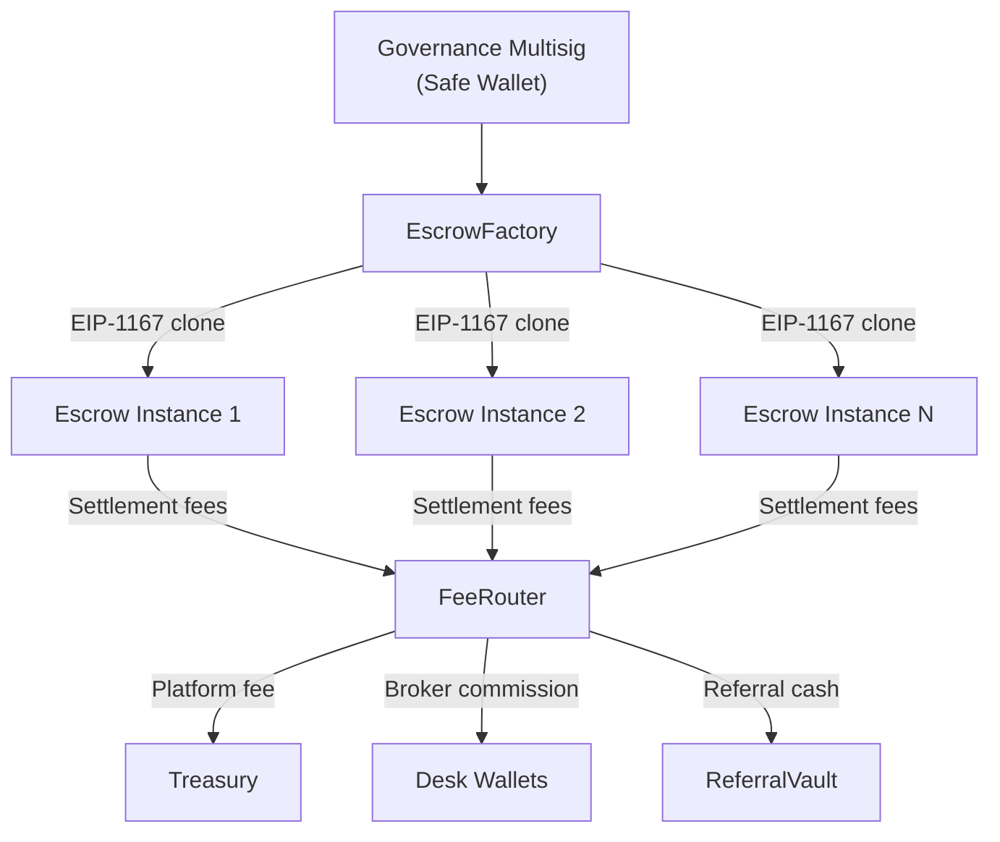

# Smart Contract Security

The DeFlow settlement layer is built on audited smart contracts deployed on the Ethereum Virtual Machine (EVM). This page explains the security architecture, design patterns, and governance framework that protect user funds.

## Design Principles

Every contract in the DeFlow settlement layer follows these core principles:

| Principle | Implementation |
|-----------|---------------|
| **Non-custodial** | Funds are locked in per-deal escrow contracts. The platform cannot access, redirect, or seize escrowed assets outside of the governance framework |
| **Atomic settlement** | Both sides of a deal execute in a single transaction. There is no intermediate state where one party has received assets while the other has not |
| **Immutable instances** | Once an escrow contract is deployed, its terms cannot be modified by any party, including the platform |
| **Payout isolation** | Core settlement cannot revert due to secondary payout failures (such as broker commissions). Failed secondary payouts are captured for administrative retry |
| **Deterministic addresses** | Escrow addresses are computed before deployment using CREATE2, enabling both parties to verify the contract address independently |

## Contract Architecture

The settlement layer consists of four primary contracts:

### Escrow

Each deal generates a dedicated Escrow contract instance. This contract:

- Holds the deposited assets from both parties
- Enforces the deal terms (amounts, expiry, dispute window)
- Executes the atomic swap at settlement
- Handles refunds on cancellation or expiry
- Emits events for every state transition

Escrow instances are deployed as EIP-1167 minimal proxies, making each deployment gas-efficient while inheriting the security properties of the audited implementation contract.

### EscrowFactory

The Factory contract manages the creation of all Escrow instances:

- Uses the EIP-1167 minimal proxy pattern for gas-efficient cloning
- Generates deterministic addresses via CREATE2
- Validates deal parameters before deployment
- Maintains a registry of all deployed escrows

### FeeRouter

The FeeRouter contract handles fee distribution at settlement:

- Calculates the net fee after applying tier discounts, referral credits, and partner rebates
- Routes the platform fee to the treasury multisig
- Routes broker commissions to the appropriate desk wallets
- Enforces the 0.10% revenue floor

### ReferralVault

The ReferralVault contract manages cash withdrawals for referral earnings:

- Holds USDC for pending withdrawal requests
- Validates withdrawal amounts and cooldown periods
- Executes payouts to referrer wallet addresses

## Safety Patterns

### Reentrancy Protection

All state-changing functions in the Escrow and FeeRouter contracts implement reentrancy guards. External calls (token transfers) are performed after all internal state updates, following the checks-effects-interactions pattern.

### Access Control

| Role | Capabilities |
|------|-------------|
| **Deal parties** | Fund and cancel their own side of a deal |
| **Platform governance** (multisig) | Pause contracts, resolve disputes, upgrade the Factory |
| **No single key** | No individual private key can modify contract behaviour; all administrative actions require multisig approval |

### Emergency Controls

The governance multisig (Safe{Wallet}) has the ability to:

- **Pause** the EscrowFactory to prevent new deal deployments in an emergency
- **Seize** funds from an active escrow in the event of a confirmed exploit or regulatory order (requires multisig consensus)
- **Upgrade** the Factory implementation (existing escrows remain immutable)

::callout{type="note"}
Emergency controls require consensus from the platform governance multisig. No single operator can execute these actions unilaterally.
::

### Block Confirmation Finality

The platform waits for a defined number of block confirmations before treating an on-chain event as final:

| Network | Required Confirmations |
|---------|:---------------------:|
| Ethereum Mainnet | 6 blocks |
| Sepolia (Testnet) | 6 blocks |
| Anvil (Local dev) | 1 block |

Until the required confirmations are reached, the platform displays the transaction as "pending" and does not update deal status.

## Audit Status

The smart contract suite is undergoing formal security review. Audit reports will be published on this page upon completion.

::callout{type="tip"}
You can inspect any escrow contract directly on a block explorer. The contract address is displayed on the deal detail page. All contract source code is verified on-chain.
::

## Wallet Security Best Practices

To protect your assets when using the platform:

- **Use a hardware wallet** for high-value transactions
- **Verify transaction details** in your wallet before signing, including the recipient address and amount
- **Never share your private key** or recovery phrase with anyone, including DeFlow team members
- **Use a dedicated trading wallet** separate from your long-term storage wallet
- **Enable notifications** in your wallet provider to monitor incoming and outgoing transactions

## Next Steps

To learn about partnership opportunities and institutional onboarding, see the [Partner Program](/partners/partner-program).
